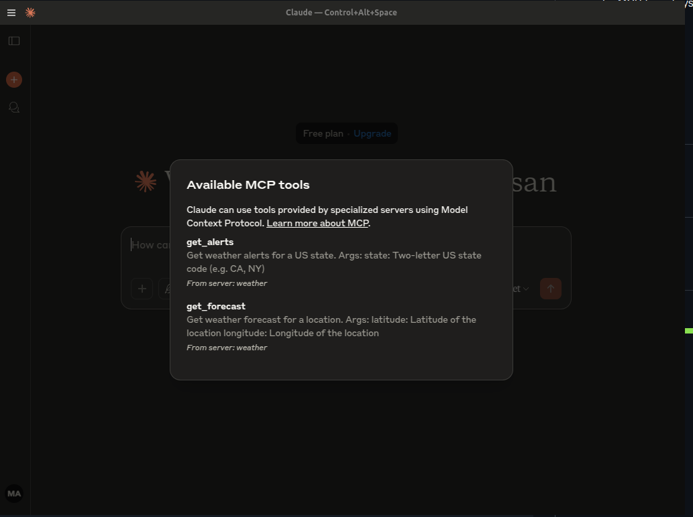
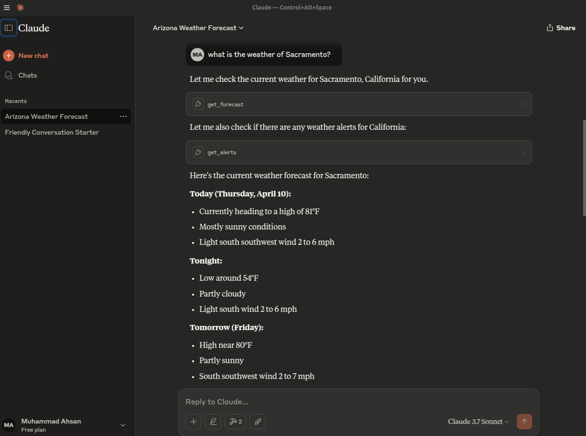

# Simple MCP Weather Server  

A minimal weather server implementation based on the official **Model Context Protocol (MCP)** documentation.  

## 🔗 Learn More  
For detailed setup and usage, refer to the [MCP Quickstart Guide](https://modelcontextprotocol.io/quickstart/server).  

## Experimental Results  

  
*Fig 1: Showing available custom tools in Claude Desktop Client*  

  
*Fig 1: Showing experimental chat with custom tools in Claude Desktop Client* 